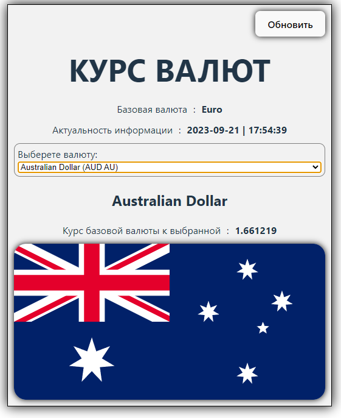

# Приложение просмотра курса валют
Приложение позволяет просматривать актуальные курсы валют относительно базовой валюты (в случае с этим приложением - это EUR).
Информация подгружается из сети Интернет при запуске приложения со следующих источников: 
- fixer.io
- country.io

## Использованные технологии:
- React.JS
- Vite
- Electron

## Реализованные функции:
- Обновление данных из интернета по кнопке "Обновить" (кнопка блокируется в процессе загрузки. При ошибке загрузки показывается сообщение об ошибке.)
- Загрузка флага страны, чья валюта выбрана для сравнения.

